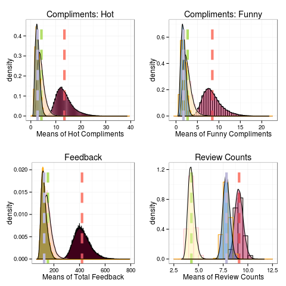
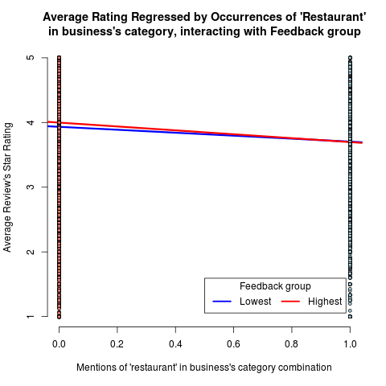

The (Regression) Line Between Joy and Misery
========================================================
author: Brian Frickert
date: 11/4/2015
transition: concave
transition-speed: slow

Coursera Data Science Specialization Captone -- Yelp! dataset

Primary Questions
========================================================

Within the *Yelp! dataset*:

There are people who are incapable of finding pleasure patronizing businesses that provide services that, on average, most everyone seems to love. **The Miserables**

Will these people hate everything?

There are people who seem to enjoy themselves at businesses that provide services that, on average, people don't seem to like all that much. **The Joyous**

Will these people love everything?

Methods
========================================================
incremental: true

Leverage user feedback to identify what separates these two types of people?

- Statistical Inference to demonstrates that **the miserables** receive far less positive feedback than the **the joyous**.
- Natural Language Processing reveals which words appear most in the **pleasuring** business categories and which appear most in the **under-pleasuring** categories.
- Linear Regression uncovers whether people with less positive *Yelp!* peer feedback like business, be they in **pleasuring** or **under-pleasuring** categories, less than those who receive lots of positive feedback.


Feedback Visualizations
========================================================

 
***
- red drop line: **the joyous**
- blue: **the miserables**
- green: total population

**The Joyous** get far more compliments, and have far more friends on *Yelp!*

Under-Pleasuring Categories
========================================================

```
  joy misery diff   pct.diff    names
1  64    213 -149 -0.5379061  restaur
2  18    100  -82 -0.6949153      bar
3  11     68  -57 -0.7215190 nightlif
4  13     62  -49 -0.6533333 american
5   5     44  -39 -0.7959184   tradit
6  13     44  -31 -0.5438596    store
```

<small>People should maybe eat out less.</small>

People With More Feedback Enjoy Restaurants LESS!
========================================================

 
***
Hypothesis refuted! People who get lots of positive feedback on *Yelp!* actually enjoy restaurants **LESS** than people who get very little positive feedback.
